<div align="center">


# Bang Motion

**An agent skill that turns your AI coding agent into a motion designer.**<br>
Openers, promos, product demos, kinetic typography, and explainers — built as a single `index.html` that plays like video, not like slides.

[](CHANGELOG.md)
[](LICENSE)
[](#install)
[](#install)

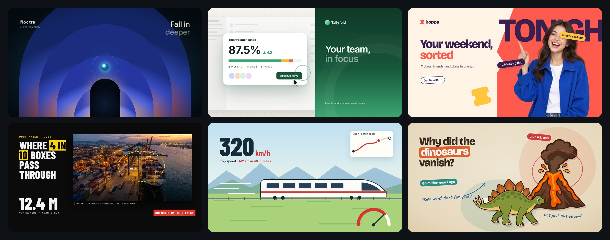

[What you can make](#what-you-can-make) · [Style gallery](#style-gallery) · [Workflow](#recommended-workflow) · [Example prompts](#example-prompts) · [Install](#install) · [FAQ](#faq)

</div>

---

## Why

Ask an AI agent for "a video" and you usually get **slides**: one section per idea, a title, a photo, a fade between them. Bang Motion encodes what a working motion designer insists on — one continuous world, a camera that actually moves, a subject that persists, text that lives inside the scene — as **rules an agent can check in its own code**, plus starters that make the right architecture the easy path.

It also stops every project from looking the same. The look is **derived from your brand** through a required style brief, the structure is **chosen from a menu of concepts**, and nothing is inherited from the starter or copied from a reference.

## What you can make

| | Output | Typical length |
|---|---|---|
| 🎬 **Openers & promos** | product launches, app promos, campaign spots, teasers | 15–40 s |
| 🖥️ **Product & SaaS demos** | UI assembled and used on screen, camera following the clicks | 20–60 s |
| 🔤 **Kinetic typography** | lyric-style statements, event announcements, manifestos | 10–30 s |
| 📺 **Bumpers, idents, channel intros** | short brand moments that loop | 3–10 s |
| 🧭 **Explainers** | six explainer styles, optional voice-over sync, 16:9 or 9:16 | 30–120 s |
| 🎞️ **After Effects builds** | cartoon explainers built directly inside AE through the Higgsfield MCP bridge | — |

Every deliverable is one `index.html`: double-click to play, autoplay + loop, `?debug=1` for a scrub bar, and an optional frame-by-frame export to MP4.

## Style gallery

> Each frame below is a **single static scene** built for this README with **fictional brands and data**. The portrait, product photos, port photo, engraving, and cartoon cutouts were generated with GPT Image 2.5; everything else is HTML, CSS, and SVG. Real projects take their palette, type, and imagery from your brand.

<table>
<tr>
<td width="50%">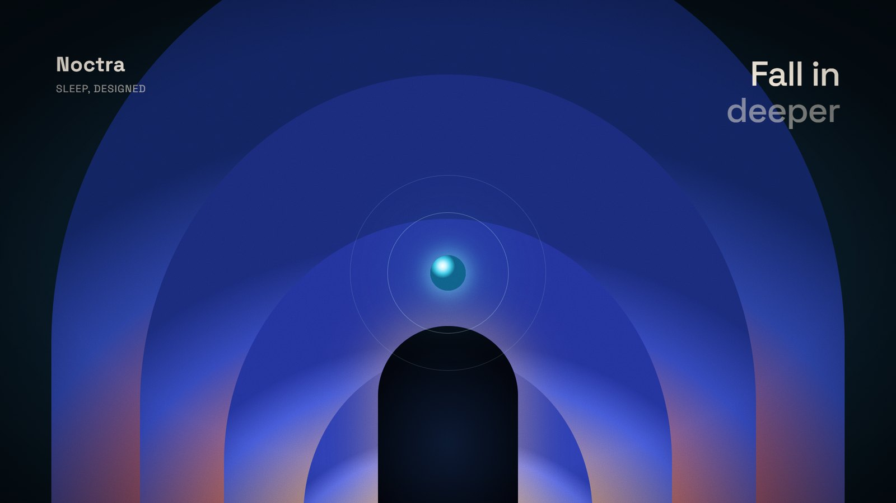<br><b>Grainy gradient</b> · opener<br><sub>Glowing layered shapes, soft grain, a camera that travels through them. Tech, AI, music, premium launches.</sub></td>
<td width="50%">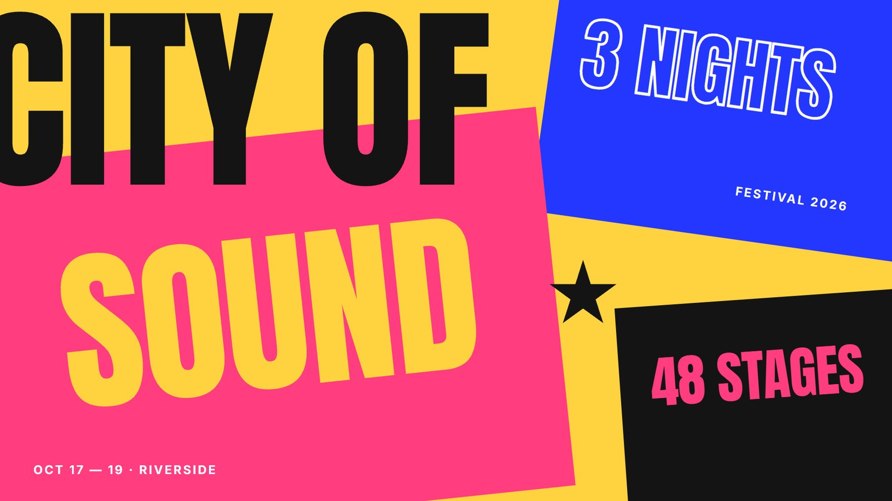<br><b>Poster color-block</b> · kinetic typography<br><sub>Huge cropped words, solid color fields that slam in on the beat. Events, music, launches.</sub></td>
</tr>
<tr>
<td>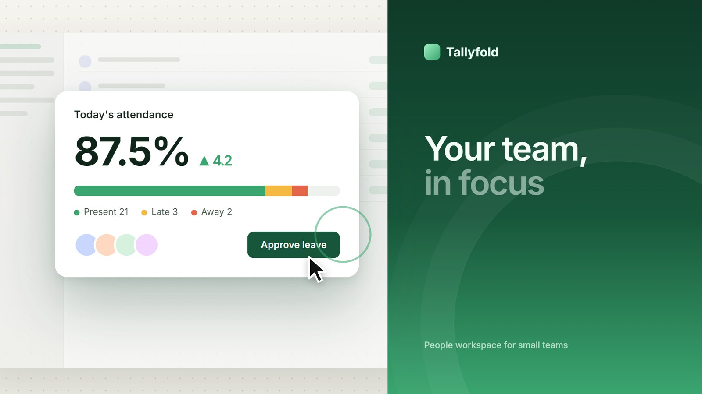<br><b>Product tour with claims</b> · SaaS demo<br><sub>Real UI lifted out of the dashboard, the camera zooms into what gets clicked. SaaS, dashboards, B2B.</sub></td>
<td>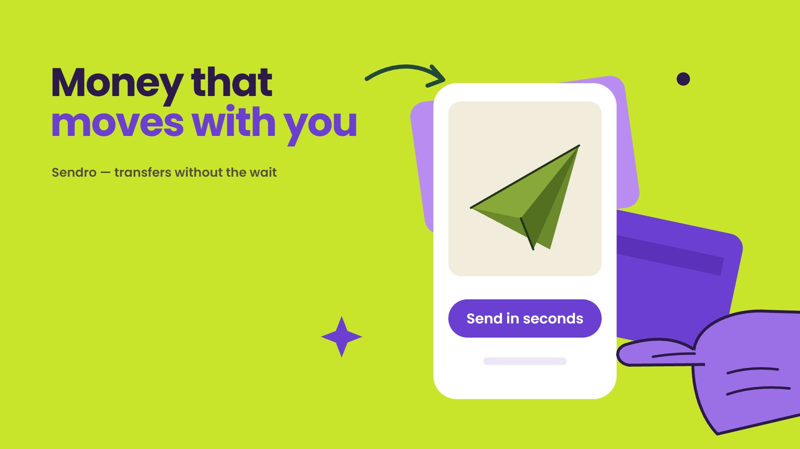<br><b>Flat vector illustration</b> · promo<br><sub>Solid fills, stylized hands, UI drawn flat, shapes with gentle overshoot. Fintech, consumer apps.</sub></td>
</tr>
<tr>
<td>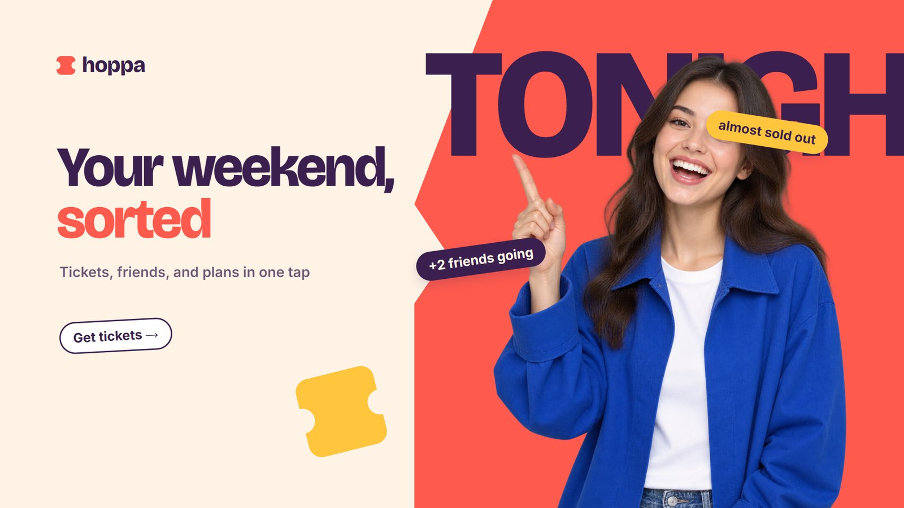<br><b>Flat pop with photos</b> · promo<br><sub>Photo cutouts popping in, stickers, brand color fields that change with a visible trigger. Consumer apps, campaigns.</sub></td>
<td>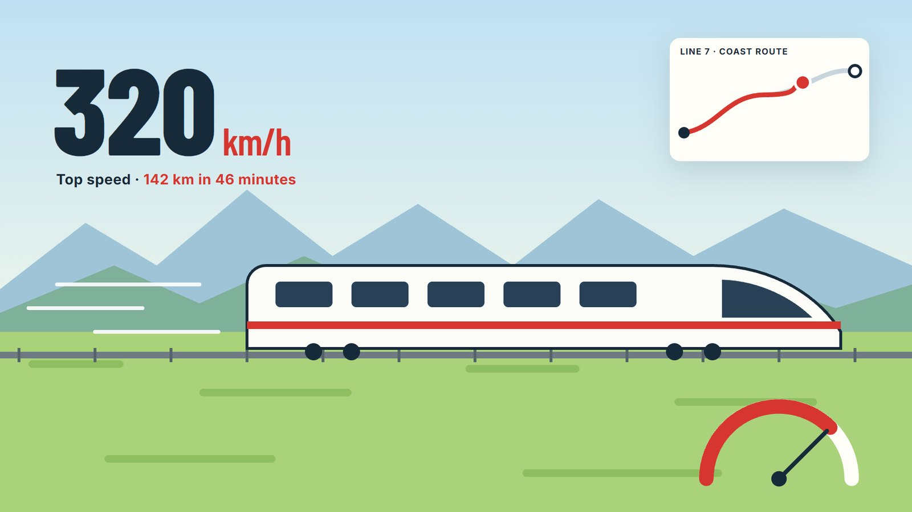<br><b>Continuous action</b> · explainer<br><sub>One subject that never stops, numbers and maps living inside the world. Speed, routes, processes.</sub></td>
</tr>
<tr>
<td>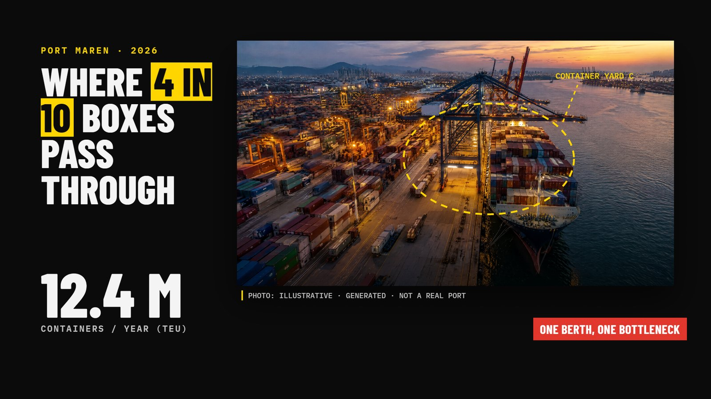<br><b>Visual journalism</b> · explainer<br><sub>Black ground, real photos with source tags, highlighter, dashed annotations. News, current issues.</sub></td>
<td>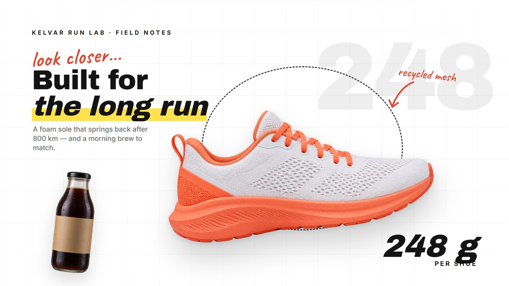<br><b>White catalog</b> · explainer<br><sub>White grid, product cutouts, mixed script and heavy sans. Products, brands.</sub></td>
</tr>
<tr>
<td>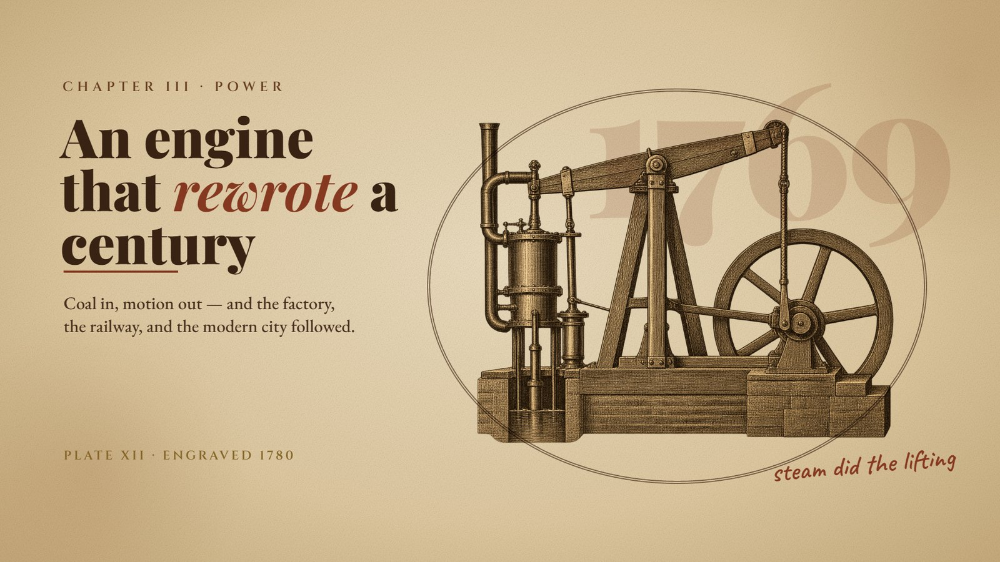<br><b>Vintage sketch</b> · explainer<br><sub>Sepia paper, engraving art, classic serifs, rust notes. History, biography.</sub></td>
<td>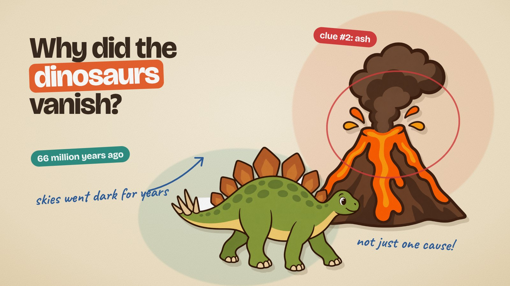<br><b>Cartoon collage</b> · explainer<br><sub>Cream paper, flat illustration cutouts, color pills, handwriting. Science, education.</sub></td>
</tr>
<tr>
<td>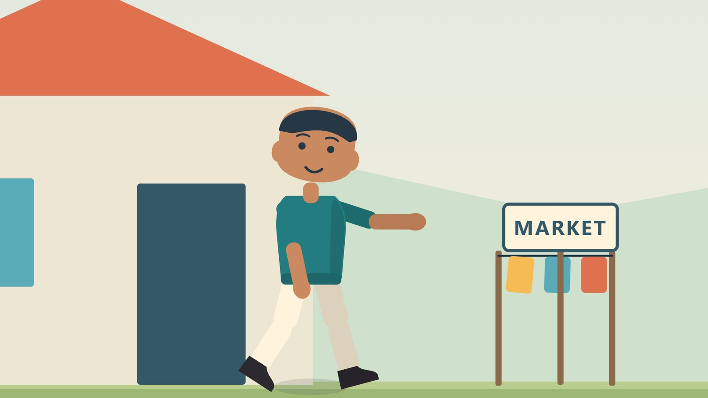<br><b>Cartoon stage</b> · explainer<br><sub>One living stage per scene, jointed characters, no captions. Education with characters.</sub></td>
<td>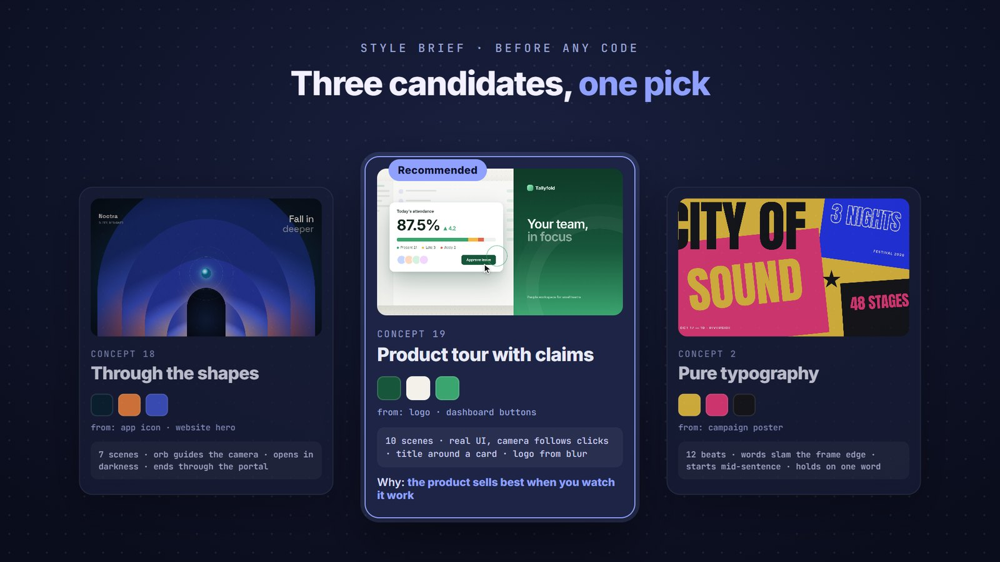<br><b>…and many more</b><br><sub>10 styles × 19 concepts × 9 render families — three candidates, one pick.</sub></td>
</tr>
</table>

## The menus behind the looks

<details>
<summary><b>10 style directions</b> — the skin, derived from your brand</summary>

| Direction | Background | Typography | Signature motion | Good for |
|---|---|---|---|---|
| Cinematic dark | near-black gradient, particles, bloom only on objects | bold clean grotesk | push-through, light in front of the lens | creative tools, gaming, tech |
| Poster color-block | large solid color fields changing per scene | ultra-heavy display, giant cropped letters | block wipes, text slamming the frame edge | consumer apps, music, events |
| Editorial light | white/cream, generous space, hairlines | display serif + small grotesk | calm slides, lines that draw | productivity, finance, SaaS |
| Paper & print | paper texture, collage, stamps, tape | handwriting + serif | objects flying in and landing | education, community, food |
| Retro / analog | faded color, grain, scanlines | 70s–90s geometric | controlled glitch, rough zoom, freeze | nostalgia, music, entertainment |
| Brutalist mono | black and white, hard grid | monospace + condensed | hard cuts, shifting blocks, blinking cursor | developer tools |
| Pastel playful | stacked pastels, big round shapes | heavy rounded sans | elastic bounce, blooming shapes | kids, health, lifestyle |
| Luxury dark | black + gold/bronze, soft shadows | tall wide-tracked serif | slow motion, sweeping light, depth | fashion, automotive, property |
| Flat pop with photos | neutral light alternating with solid brand fields | rounded heavy sans + giant cropped words | cutouts popping in, stickers, fields snapping on the beat | consumer apps, fintech, e-commerce |
| Grainy gradient | deep base, saturated glowing shapes, fine grain | small clean grotesk or minimal heavy display | layers opening, camera through the shape, a guiding orb | tech, AI, music, creative launches |

</details>

<details>
<summary><b>19 opener concepts</b> — the structure, chosen per product</summary>

| # | Concept | Good for |
|---|---|---|
| 1 | One continuous shot | creative tools, hardware, spaces |
| 2 | Pure typography | strong taglines, events, releases |
| 3 | Problem → gone | productivity, utilities |
| 4 | Before / after | editors, filters, optimization |
| 5 | Journey inside the UI | apps with a distinctive UI |
| 6 | Product macro | hardware, packaging, F&B, fashion |
| 7 | Object metaphor | security, cloud, finance |
| 8 | Living number | milestones, performance |
| 9 | One feature, fully demoed | apps with one clear edge |
| 10 | Diegetic question → answer | AI, search, support |
| 11 | Rhythmic collage | music, lifestyle, community |
| 12 | Logo as stage | brands with a strong logo shape |
| 13 | Object relay | e-commerce, delivery, marketplaces |
| 14 | Brand system showcase | launches, rebrands, communities |
| 15 | Claim → how → result | new features, generative AI, creative tools |
| 16 | Living UI ecosystem | B2B SaaS, AI assistants, workflows |
| 17 | Flat pop with photos | consumer apps, fintech, campaigns |
| 18 | Through the gradient shapes | tech, AI, security, premium launches |
| 19 | Product tour with claims | SaaS, team tools, dashboards |

Each concept ships as principles and a menu of openings, transitions, and endings — never as a script to copy.

</details>

<details>
<summary><b>6 explainer styles</b> — each with its own starter</summary>

| Style | Look | Best for |
|---|---|---|
| Continuous action | flowing vector world, one subject that never leaves, changing viewpoints | speed, routes, processes |
| Cartoon collage | cream paper, flat illustration cutouts, handwriting, color pills | science, education |
| Visual journalism | black, real photos with source tags, highlighter, dashed annotations | news, current issues |
| White catalog | white grid, photo cutouts, mixed typography, scribbles | products, brands |
| Vintage sketch | sepia paper, engraving art, classic serifs, rust annotations | history, biography |
| Cartoon stage | one stage per scene, jointed characters, no captions | education with characters |

</details>

## Recommended workflow

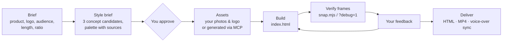

1. **Brief the agent.** Name the product, attach the logo or site, say who it is for, the length, and the ratio. Mention a style if you have one in mind — the name is enough.
2. **Approve the style brief.** The agent answers with three concept candidates, one recommendation, a structure fingerprint, and a palette where every color states its source. Change anything before a line of code is written.
3. **Settle the assets.** Your own photos and logo come first. If you have none, the agent can generate them through an image MCP (fictional faces, logos added in code) — or pick a concept that needs no photos.
4. **Let it build.** You get one `index.html`. The agent captures key seconds and checks them against the rules before handing over.
5. **Review and iterate.** Open it, scrub with `?debug=1`, and describe what feels off. Feedback lands on the same file.
6. **Deliver.** Keep the HTML, export MP4 with `scripts/export-frames.mjs`, or send a voice-over and the timeline re-times itself to it.

> **Tip:** start each new video in a **new chat**. The skill is read when it is first invoked, and a long chat keeps earlier decisions in context.

## Example prompts

```text
Make a 30-second opener for my note-taking app. Logo and screenshots attached.
```
```text
Build a 45-second product tour of our HR dashboard in the "product tour with claims" style, 16:9.
```
```text
Promo for a ticketing app in the flat pop with photos style — generate fictional people, 9:16, 20 seconds.
```
```text
Kinetic typography for our festival announcement: "City of Sound, 3 nights, 48 stages". Loud, color-block.
```
```text
Explain how a container port works in 60 seconds, visual journalism style, no voice-over.
```
```text
A cartoon explainer on why volcanoes erupt, for kids, 9:16, I will send a voice-over later.
```

**Getting better results**

- Say *which style*, not *which scenes*. "Grainy gradient" gives you the look; listing a reference's scenes gives you a copy.
- Hand over real brand material — logo, site, app screenshots, photos. The palette and shapes are derived from it.
- Want one specific moment? Ask for it explicitly; otherwise the agent composes new ones.
- Keep text short. Openers carry one feeling, explainers one argument.

## Install

Bang Motion follows the open **Agent Skills** layout: a folder with `SKILL.md` (frontmatter + instructions), `references/`, `assets/`, `scripts/`. It also ships as a Claude Code **plugin**.

### As a plugin (Claude Code)

```
/plugin marketplace add bangtutorial/bang-motion
```
```
/plugin install bang-motion@bang-motion
```

Update later with `/plugin marketplace update bang-motion`.

### Manual (any agent)

```bash
git clone https://github.com/bangtutorial/bang-motion
```

| Agent | Where it goes |
|---|---|
| Claude Code | `~/.claude/skills/bang-motion` (Windows: `C:\Users\<you>\.claude\skills\bang-motion`) |
| Codex CLI | your Codex skills folder, or add to `AGENTS.md`: *"For motion graphics / explainers, read and follow `bang-motion/SKILL.md`."* |
| Gemini CLI · Cursor · others | copy into the project and reference `SKILL.md` from `GEMINI.md`, `.cursor/rules`, or the system prompt |
| Plain chat (no agent) | paste `SKILL.md` + the relevant file in `references/` as instructions; attach a starter from `assets/` |

> Install **one copy** only. Two copies with the same skill name (for example a plugin and a manual folder) conflict, and the plugin wins.

The skill triggers on requests like "make an opener…", "promo video…", "explainer…", or a complaint that a web animation "looks like PowerPoint".

## Requirements

| To… | You need |
|---|---|
| **Watch** the result | a browser + internet (GSAP and fonts load from a CDN). Nothing else. |
| Verify frames automatically | Node + puppeteer (`scripts/snap.mjs`) — optional; `?debug=1` works by hand |
| Export MP4 | Node + puppeteer + ffmpeg (`scripts/export-frames.mjs`) — optional |
| Sync to voice-over | ffmpeg, **or** nothing: `scripts/vo-pauses.html` detects pauses in the browser |
| Generate images | any image MCP the agent can call — optional |
| Build in After Effects | After Effects + the Higgsfield MCP bridge — optional |

A deliverable never needs `npm install` to be watched.

## How the rules work

- **Style brief before code** — concept, structure fingerprint, palette with sources, display font, background surface and motion, render family, transitions, one special moment.
- **Structure from a menu** — three concept candidates per project, at most two "canonical" components, and a different fingerprint from the previous video.
- **Examples are principles, not scripts** — openings and endings differ from the concept's example, signature moments are transformed, and the example's colors and shapes never carry over.
- **Living typography** — sentence case, emphasis by order, size, or pause; word highlights and punctuation only when they add meaning.
- **A background that never sits still** — a chosen background motion, and color changes with a visible trigger.
- **A camera that works** — breathing drift, motivated push-throughs, and in UI demos a camera that follows the important clicks.
- **Structural anti-slide checks** — no fading sections, a persistent subject or world, at most two text levels, varied transitions with real depth.
- **Readable on phones** — no text under 30 px on a 1080-wide stage.

Full detail lives in `SKILL.md` and `references/`.

## Repository layout

```
SKILL.md                         rules & workflow (read by the agent)
.claude-plugin/                  plugin + marketplace manifests
references/
  opener-konsep.md               19 opener concepts, UI animation, photos in openers
  anti-ppt.md                    slide patterns → fixes
  techniques.md                  typography, camera, transitions, backgrounds, render families
  explainer.md                   explainer styles, camera recipes, VO re-timing
  kartun-panggung.md             cartoon stage explainers
  architecture.md                stage, camera rig, determinism, export
  ae-bridge-higgsfield.md        building inside After Effects via the MCP bridge
  roadmap.md                     where the skill is heading
assets/
  starter-opener.html            opener / promo architecture (GSAP + Three.js)
  starter-explainer*.html        one starter per explainer style
scripts/
  snap.mjs                       verify: capture key seconds
  export-frames.mjs              export: frame-by-frame PNG → MP4
  vo-pauses.html                 voice-over pause detection, no ffmpeg needed
  serve.py                       no-cache dev server (optional)
  ae/bridge/                     After Effects bridge helpers
docs/gallery/                    README preview images
```

## FAQ

<details>
<summary><b>Is the output a video file?</b></summary>

The deliverable is an `index.html` that plays like a video: autoplay, loop, no player chrome. When you need a file, `scripts/export-frames.mjs` renders it frame by frame to MP4.
</details>

<details>
<summary><b>Will every video end up looking the same?</b></summary>

That is the main thing the skill prevents. The palette and shapes come from your brand, the structure comes from a concept chosen for your product, and each project must differ from the previous one in both skin and structure.
</details>

<details>
<summary><b>Can I give it a reference video?</b></summary>

Yes. The agent takes rhythm, energy, and motion language from it — not the palette, fonts, layout, scene order, or signature moments.
</details>

<details>
<summary><b>Do I need photos?</b></summary>

Only for photo-based styles. Use your own, a licensed stock set, or let the agent generate fictional people and props through an image MCP. Otherwise pick an illustrated or typographic style.
</details>

<details>
<summary><b>Can it build in After Effects?</b></summary>

Yes, for cartoon explainers: with After Effects open and the Higgsfield MCP bridge connected, the agent builds compositions, characters, and keyframes directly in AE.
</details>

## Contributing

Issues and pull requests are welcome. When you add a rule, describe which failure it prevents and offer it as a menu option rather than a single "right answer". Bump `version` in `SKILL.md` and the plugin manifests, and add a line to `CHANGELOG.md`.

## License

[MIT](LICENSE) © 2026 [Bang Tutorial](https://youtube.com/bangtutorial)
